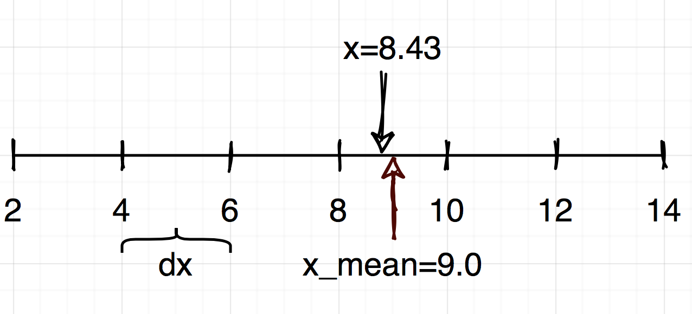
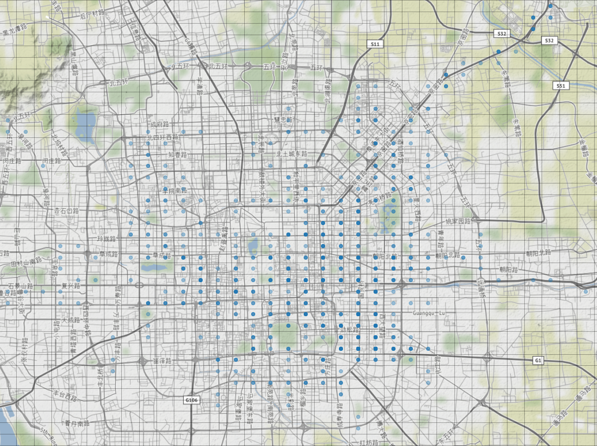
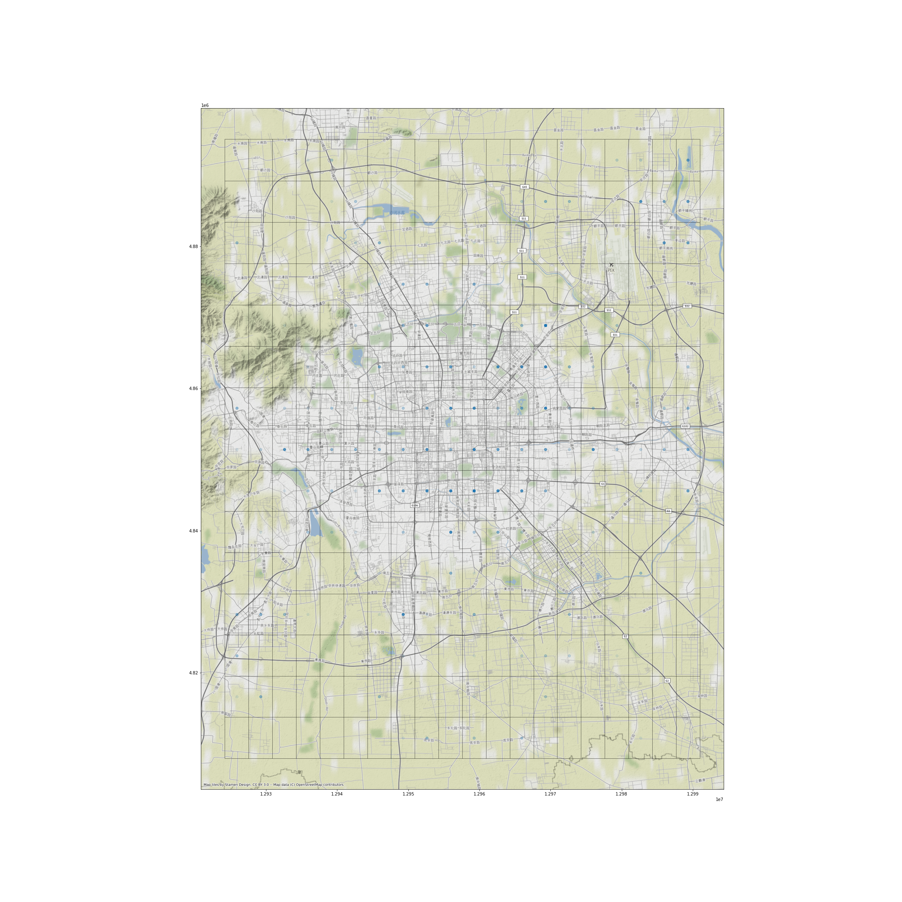
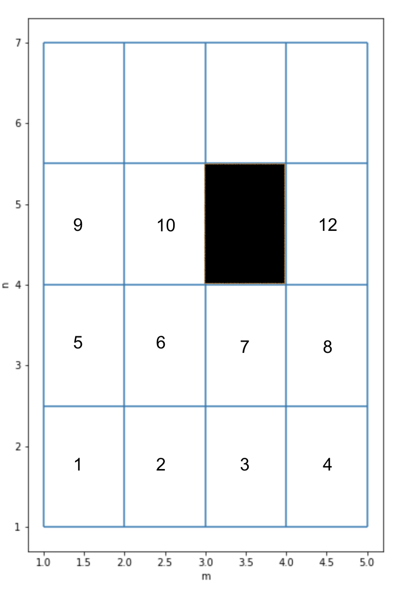
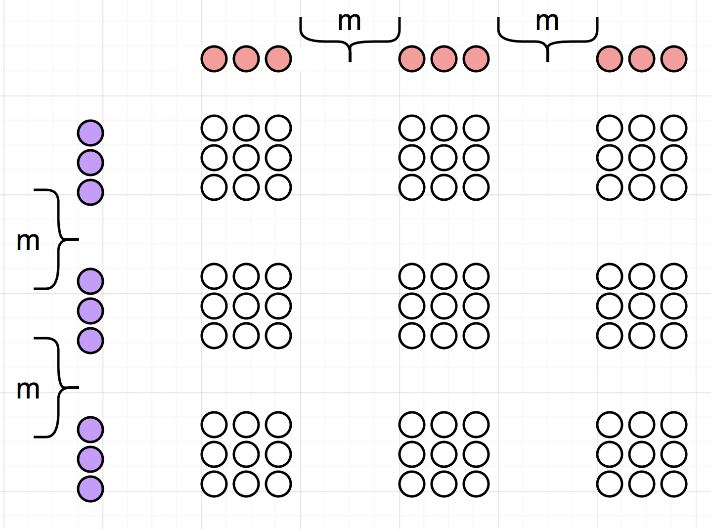
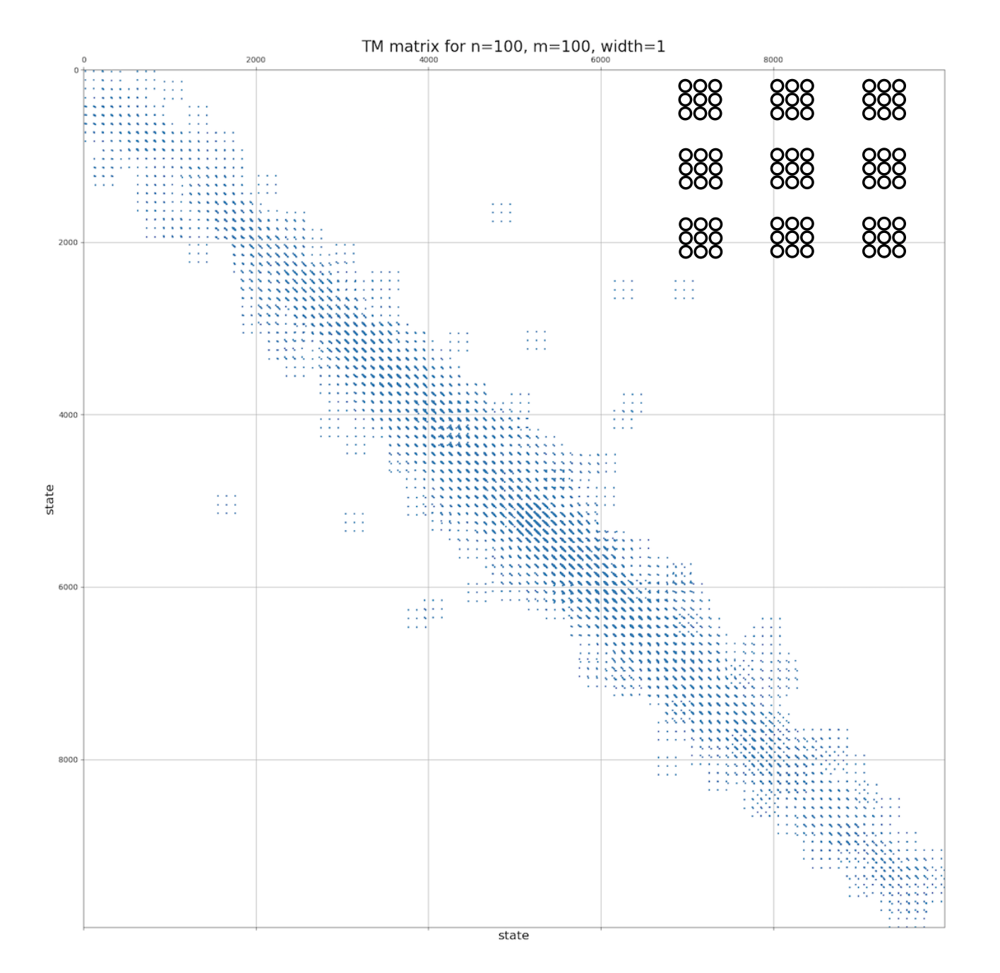

Implementation
==============

The surface of interest is being partitioned by the rectangular grid, with the number of cells  along latitude and longitude as parameters, `m` and `n`.
For all trajectory's points within each cell  we calculate the mean value and put it into  the center of the cell.

For one dimensional cell, the procedure for mean value :math:`x_{center}` calculation will look like.

.. math::
    A=2; B=14; m=6; x=8.43

    dx = (B - A)/m =2

    i = ceil((x - A) / dx) = 4

    x_{center}= A + dx * (i - 0.5) = 2+2*3.5=9

Therefore,  :math:`x_{center} = 9, \forall x\in[8,10]`, taking care of border cases.

After tesselating  the surface into :math:`n\times m` rectangulars, and projecting the coordinates into the  center of cell,
we calculate the timestamp for that cell as mean of the timestamps, while the object was within the  cell.

.. math::

    (x^j, y^j) = (x^j_{center}, y^j_{center}),

    t^j = \frac{1}{k}\sum_{i=1,k}{t^j_i},

where :math:`\forall j\in[1, n\times m]`,  `k` -- is the number of points of the trajectory
(and timestamps) while object was within cell `j` before moving into another cell, and (`n, m`) are the number of
splits along latitude and longitude.

One can see  rectangular cells with the points inside at the figure below. Some points are darker than the other,
meaning that that particular cell  been visited more than once.

The schema for the PySpark DataFrame after that transformation looks like the following:

.. code-block:: console

     root
     |-- id: integer (nullable = true)          // track ID
     |-- lat_idx: integer (nullable = true)     // index of the cell along latitude
     |-- lon_idx: integer (nullable = true)     // index  of the  cell along longitude
     |-- avg_ts: timestamp (nullable = true)    // average time for  the timestamps of points in the cell
     |-- lon_middle: float (nullable = true)    // longitude of the center of the cell
     |-- lat_middle: float (nullable = true)    // latitude of the center of the cell
     |-- ts_1: timestamp (nullable = true)      // timestamp when the user entered the cell
     |-- ts_2: timestamp (nullable = true)      // timestamp when the user left the cell

Each row in the DataFrame allows to identify the user, its location and timestamp associated with it, and the amount of time spend in that location.

Such kind of information is enough to calculate the regions, where the users are static. Those could be affiliated with Origins or Destinations, just by filtering those row where users spent more than certain amount of time, say 6 hours, between 24 and 6 in the morning.

.. code-block::  console

    df\
    .filter(F.col('id').isin(list(range(1, 1000))))\
    .withColumn('duration', (F.col('ts_2').cast('long')-F.col('ts_1').cast('long')))\
    .select(['id','lon_middle', 'lat_middle', 'duration', 'ts_1'])\
    .filter(F.col('duration') > 6*3600)\
    .filter(
        (F.hour(F.col('ts_1')) > 0 ) & (F.hour(F.col('ts_1')) < 6)
    )\
    .toPandas()

Thoose cells could be marked as Origins, for instance.

State vectors and Transition  Matrix
------------------------------------

All :math:`n\times m` cells form a state vector of  :math:`n\times m`  length in the Markov process.

Transition between cells along the trajectory corresponds to   move  between states.

The only non-zero element in this vector  is located at  the :math:`m(i-1) + j` position.

For example, on the figure below, the blackened cell will correspond to the nonzero entry at :math:`(i,j)=(3,3)=>m(i-1) + j = 4*2+3=11`.

The transition matrix is a square matrix, whose  elements :math:`a(i,j)` are  the probabilities of      moving from the state
`i` to the state `j`. Since the length of the state vector is :math:`n\times m`,  the shape of  the transition matrix  is
:math:`(nm\times nm)`.

State vector for "distributed state" and Transition Matrix
----------------------------------------------------------

In  the text above we assumed that the object  is located in a single cell, e.g. :math:`c(i,j)`, where :math:`\forall i\in[1..n]`
and :math:`\forall j \in [1..m]` are the indexes along latitude and longitude correspondingly.

A more general case is to assume that the location of the object is not known exactly, but with certain probability.
For example, one may think that the probability of the object location is smeared out over a cloud (set) of  `q` cells,
:math:`c_{ij}`:

.. math::

    \sum_{k=1}^{q}p_{k}(c_{ij}) = 1,

where :math:`p_{k}(c_{ij})` is the probability of the object to be located in the `k`-th element  of  the set,
and  :math:`{ij}` are the coordinates in the rectangular grid.

In  this case the system is in a **distributed state**, and it's state vector has `q` nonzero entries (out of :math:`n\times m`), summing up to 1.

A transition  matrix in this case will have the same meaning, but will have more complex structure.
Lets assume that :math:`q=9`, and the  state will be distributed among 9 adjacent cells on the plane surface:

    +-------------+------------+------------+
    |`(i-1, j-1)` | `(i-1, j)` |`(i-1, j+1)`|
    +-------------+------------+------------+
    | `(i,j-1)`   |  `(i,j)`   | `(i,j+1)`  |
    +-------------+------------+------------+
    | `(i+1,j-1)` |  `(i+1,j)` | `(i+1,j+1)`|
    +-------------+------------+------------+

    with :math:`(i,j)` being location of a central cell.

1D representation
+++++++++++++++++

From 2D notion we will move to 1D:

:math:`x = \{\dots \\ m(i-1)+j-1, m(i-1)+j, m(i-1)+j+1 \dots \\ mi+j-1, mi+j,  mi+j+1, \dots \\ m(i+1)+j-1, m(i+1)+j, m(i+1)+j+1 \\
\dots\}`

where `m` -- the number  of columns, and :math:`\lvert x \rvert = m\times n`.

Those 9  states will give rise to :math:`9\times 9=81` entries in the transition matrix between two states with central cells
:math:`(i_1, j_1) (blue)\to (i_2, j_2) (red)`.

Since :math:`\sum x_1  =1`  and :math:`\sum x_2  =1`, so for  their outer product is valid :math:`\sum(x_1\otimes x_2)  =1`,
where :math:`x_1` and :math:`x_2` are the :math:`\lvert x_1 \rvert = \lvert x_2 \rvert =  m\times n` distributed  state vectors.

Indeed, let :math:`x_1` be a distributed state vector, so :math:`\sum_{i=1}^{n\times m} \alpha_i =1`, where :math:`\alpha_i` is the probability for the system to be found in state `i`. Having the  similar for :math:`x_2` we can write for the transition :math:`x_1 \to x_2` : :math:`\sum_{i,j=1}^{n\times m} \alpha_i\beta_j = \sum_{i=1}^{n\times m} \alpha_i \sum_{j=1}^{n\times m} \beta_j = 1`.

The gap of length `m` is shown with  curly bracket. For `q=1`, that is then the distribution is a Dirak's delta function,
a state would be described by 1 number and the transition by 1 number as well. For case `q=25`,
the state would be given by 25 numbers, and the transition by 625 numbers.

Contributions  from consecutive transitions are accumulated into the Transition Matrix, and normilized afterwards:
:math:`\sum_{i=1}^{n\times m} c_{ij}=1`,  :math:`\forall j\in[1\dots n\times m]`.

Each set of 9 dots  in reality corresponds to 81, as shown in the inset,
`width` is the number of layers around the central cell, `width=1` for  `q=9`, `width=2` for `q=25` and so on.

Origin-Destination matrix
-------------------------

Origin-Destination matrix (OD) resembles TM  with one difference -- destination is separated from the origin not by one time-step, but by multiple, which has a default of 2  hours, and can be set as a parameter, `T`.

..  image:: pics/OD.png
  :width: 500
  :alt: Alternative text

The data for OD are being  collected in a  sliding window manner with the `T` time window size.
Such  strategy allows to filter afterwards **any** Origin, Destination and Time, separated by  the given `T`.

See the sketch below, where :math:`s_i = (O_i, D_i, t_i)` is  a triplet of Origin, Destination and  time for the origin, and :math:`T=3`.

..  image:: pics/OD_sliding.png
  :width: 500
  :alt: Alternative text

